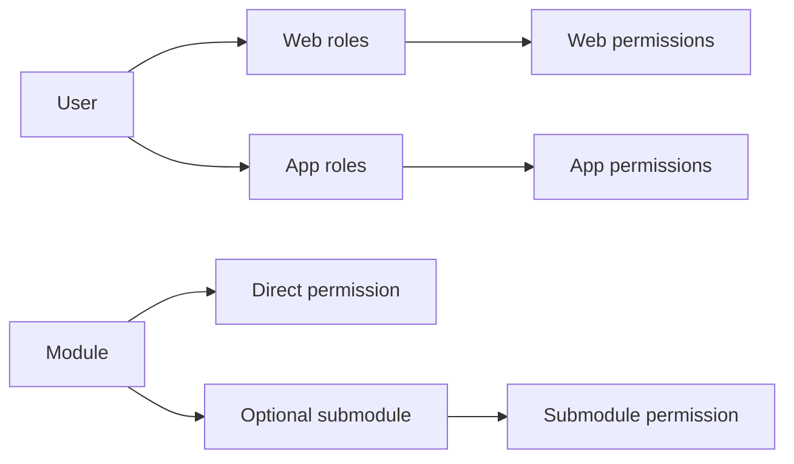

# Laravel Role Permissions

A reusable Laravel package by **Mahadi Hasan Shakil**, based on the original article:
[Laravel Custom Role Permission on Medium](https://medium.com/@shakil3334426/laravel-custom-role-permission-289e18512eb0).

Separate **web** and **app** permissions, organize them into modules and optional submodules, and assign one or multiple roles to each user.

## Requirements

| Laravel | PHP |
| --- | --- |
| 12 | 8.2+ |
| 13 | 8.3+ |

Use the same database connection for authenticatable models and package models. The supplied migration uses integer user IDs. For UUID/ULID users, change `rbac_model_role.model_id` to the matching type **before** running the migration.

## Permission structure



A module can have direct permissions, submodules, or both. Modules and submodules organize the shared catalog; they do not grant access themselves. Each permission belongs to exactly one module and optionally one submodule of that module.

Role and permission slugs are unique **within a scope**. For example, `orders.view` may exist separately for `web` and `app`. Granting the web permission does not grant its app counterpart.

## Installation

Composer package name: `shakil3334413/laravel-role-permissions`.

Install in your Laravel application:

```bash
composer require shakil3334413/laravel-role-permissions
php artisan vendor:publish --tag=permissions-migrations
php artisan vendor:publish --tag=permissions-config
php artisan migrate
```

Laravel automatically discovers the service provider. No Kernel edits are needed.

Alternatively, install the development branch directly from GitHub:

```bash
composer config repositories.laravel-role-permissions vcs https://github.com/shakil3334413/Laravel-Role-Permissions
composer require shakil3334413/laravel-role-permissions:dev-master
```

Then publish the migrations/configuration and migrate as above. If the repository branch is different, use its actual branch name.

For local development, add a Composer `path` repository pointing to this checkout instead of the VCS repository.

## Add the trait and contract

Preserve the existing contents of your application's User model and add:

```php
use Illuminate\Foundation\Auth\User as Authenticatable;
use Shakil\Permissions\Concerns\HasRoles;
use Shakil\Permissions\Contracts\HasPermissions;

class User extends Authenticatable implements HasPermissions
{
    use HasRoles;

    // Keep your existing traits, attributes, and methods.
}
```

No `users.role_id` column is needed.

## Module without a submodule

```php
use Shakil\Permissions\Models\Module;
use Shakil\Permissions\Models\Permission;

$dashboard = Module::firstOrCreate(
    ['slug' => 'dashboard'],
    ['name' => 'Dashboard'],
);

Permission::firstOrCreate(
    ['scope' => 'web', 'slug' => 'dashboard.view'],
    ['name' => 'View dashboard', 'module_id' => $dashboard->id],
);
```

`submodule_id` remains null.

## Module with submodules

```php
$sales = Module::firstOrCreate(['slug' => 'sales'], ['name' => 'Sales']);

$orders = $sales->submodules()->firstOrCreate(
    ['slug' => 'orders'],
    ['name' => 'Orders'],
);

foreach (['web', 'app'] as $scope) {
    // The relation sets both module_id and submodule_id.
    $orders->permissions()->firstOrCreate(
        ['scope' => $scope, 'slug' => 'orders.view'],
        ['name' => 'View orders'],
    );
}
```

The database rejects a submodule belonging to a different module.

Retrieve the hierarchy:

```php
$modules = Module::with([
    'directPermissions',
    'submodules.permissions',
])->get();

$sales->permissions;       // All permissions under Sales.
$sales->directPermissions; // Only permissions without a submodule.
$orders->permissions;      // Only permissions in Orders.
```

Filter these relations by `scope` when building a web-only or app-only administration screen.

## Create roles and grant permissions

```php
use Shakil\Permissions\Models\Role;

$webEditor = Role::firstOrCreate(
    ['scope' => 'web', 'slug' => 'editor'],
    ['name' => 'Web Editor'],
);
$appViewer = Role::firstOrCreate(
    ['scope' => 'app', 'slug' => 'viewer'],
    ['name' => 'App Viewer'],
);

$webEditor->givePermissionTo('orders.view');
$appViewer->givePermissionTo('orders.view');
```

The role's scope selects the correct permission. Cross-scope role-permission grants are rejected by foreign keys, including direct database writes. Renaming display names does not change authorization; keep slugs stable after use.

## Single-role and multiple-role assignment

```php
// $user is an existing user selected by trusted administration code.

// Replace every web role with exactly one role; app roles are preserved.
$user->setRole('editor', 'web');

// Add one app role.
$user->assignRole('viewer', 'app');

// After creating the manager role in the web scope, add several web roles.
$user->assignRoles(['editor', 'manager'], 'web');

// Replace web assignments with this exact set.
$user->syncRoles(['editor', 'manager'], 'web');

// Clear web roles while preserving app roles.
$user->syncRoles([], 'web');

// Remove a specific app assignment.
$user->removeRole('viewer', 'app');
```

Assignment methods accept slugs and throw `ModelNotFoundException` for missing roles. A failed multi-role operation leaves existing assignments intact. Repeated assignments do not create duplicates.

To enforce a single role per user **per scope**, set this in `config/permissions.php`:

```php
'role_mode' => 'single',
```

In single mode, `assignRole()` replaces the previous role in the specified scope, and passing more than one role to `assignRoles()` or `syncRoles()` throws `InvalidArgumentException`. In the default `multiple` mode, grants from active roles are combined; `setRole()` still provides explicit single-role replacement.

Use the package assignment methods to enforce single mode. Raw SQL or `roles()->attach()` bypass that application-level rule. When switching an existing project from multiple to single mode, normalize existing assignments with `setRole()` first. Switching configuration does not silently remove existing data.

## Protect website and API routes

```php
// routes/web.php
Route::get('/orders', [OrderController::class, 'index'])
    ->middleware(['auth', 'can:permission:web:orders.view']);

// routes/api.php — if your application uses Sanctum.
Route::get('/orders', [ApiOrderController::class, 'index'])
    ->middleware(['auth:sanctum', 'can:permission:app:orders.view']);
```

Use the auth middleware appropriate to your application. An authorization scope is separate from a Laravel authentication guard. The package does not install Sanctum or infer the scope from a URL, token, request header, or user input.

Always specify scope in Gate abilities. `permission:orders.view` is deliberately denied.

```php
$user->hasPermissionTo('orders.view', 'web');
$user->hasPermissionTo('orders.view', 'app');
$user->hasRole('editor', 'web');

$user->can('permission:web:orders.view');
Gate::authorize('permission:app:orders.view');
```

```blade
@can('permission:web:orders.view')
    <a href="/orders">Orders</a>
@endcan
```

Direct method calls default to `web` for convenience; use explicit scopes in application code. Hiding UI elements does not protect endpoints: add authorization to every sensitive route.

## Revocation and deletion

```php
$webEditor->revokePermissionTo('orders.view');
$webEditor->update(['is_active' => false]);
$user->removeRole('editor', 'web');
```

Every permission check queries current grants. Revocation and role deactivation take effect on the next check even when relations were previously loaded.

Modules/submodules containing permissions cannot be deleted until their permissions are removed or reassigned. Role and permission deletion cleans corresponding grants through foreign keys. Eloquent deletion of a user removes role assignments; soft deletion preserves them until force deletion. Bulk/raw deletes bypass Eloquent events and require explicit assignment cleanup.

A saved role cannot change scope through the model API; create a new role instead.

## Configuration

```php
return [
    'gate_prefix' => 'permission:',
    'scopes' => ['web', 'app'],
    'role_mode' => 'multiple',
];
```

Additional scopes may be configured as lowercase identifiers of up to 32 characters. Unknown scopes deny checks and reject API writes. Run `php artisan config:cache` after changing production configuration.

## Boundaries

- Global role catalog: tenant-specific roles are not included.
- No automatic Admin bypass, wildcard permissions, direct user grants, or administration UI.
- Modules/submodules organize permissions; granting one permission does not grant sibling permissions.
- Permissions authorize an action, not ownership of a particular record. Combine `hasPermissionTo()` with ownership/tenant checks inside application policies.
- The package rejects model arguments on its Gate abilities. Ordinary application Gates and policies retain their normal behavior.
- The Gate prefix is reserved. Application-wide `Gate::before` callbacks that return true can override authorization, so avoid conflicting global bypasses.
- Authorize all role/permission administration in the host application. Do not assign roles directly from untrusted request input.
- Assignment transactions assume the user and package models use the same database connection.
- This schema replaces the earlier unpublished scaffold. Existing blog tables and old `rbac_*` tables require an explicit data migration; do not rerun the new initial migration over them. See [migration notes](docs/MIGRATION.md).

## Tests

```bash
composer install
composer validate --strict
composer test
```

The test suite covers direct/nested permissions, web/app isolation, database constraints, single/multiple assignment, revocation, HTTP authorization, deletion, and rollback. CI tests Laravel 12 and 13 with their compatible PHP versions.

## Original article and license

[Read the original Medium blog by Mahadi Hasan Shakil](https://medium.com/@shakil3334426/laravel-custom-role-permission-289e18512eb0).

MIT — see [LICENSE](LICENSE).
